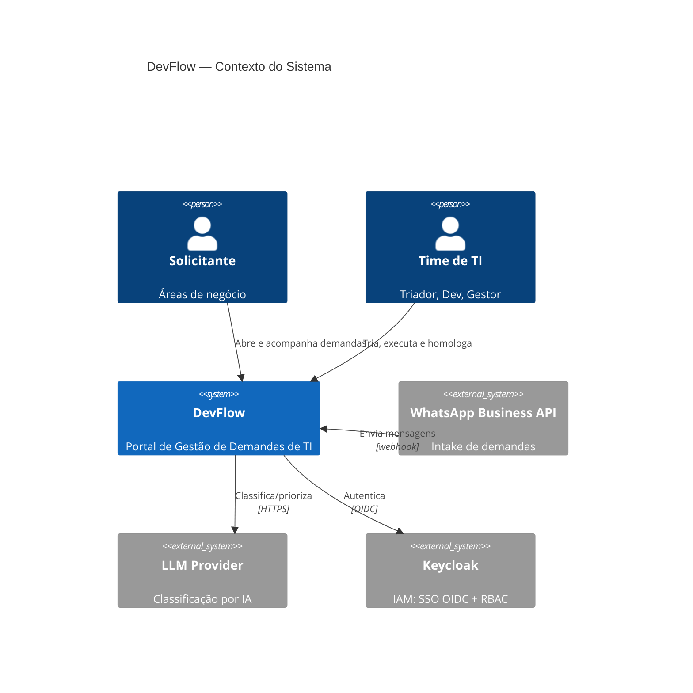

# DevFlow — Portal de Gestão de Demandas de TI

> Proposta de arquitetura e solução para estruturar a gestão de demandas internas de Tecnologia:
> backlog, workflow, SLA, governança, auditoria e rastreabilidade ponta a ponta.

## Contexto

Em operações em crescimento acelerado, as demandas internas de TI (vindas de áreas como Comercial,
Atendimento, Financeiro, Marketing, Jurídico e Operações) costumam chegar por canais informais —
**WhatsApp e e-mail** — sem backlog estruturado, sem priorização formal, sem SLA, sem histórico de
mudanças e sem rastreabilidade das entregas.

O **DevFlow** resolve isso: um portal onde qualquer área abre solicitações para TI e acompanha todo o
ciclo de entrega, com governança e métricas.

## Sumário da solução

| Dimensão | Decisão | Documento |
|---|---|---|
| Requisitos | Funcionais (MoSCoW) + não funcionais mensuráveis | [docs/01-requisitos.md](docs/01-requisitos.md) |
| Arquitetura | Monólito modular (DDD tático) → microserviços por evolução; C4 + ADRs | [docs/02-arquitetura.md](docs/02-arquitetura.md) |
| Dados | Modelo relacional 3FN com histórico e auditoria append-only | [docs/03-modelagem-dados.md](docs/03-modelagem-dados.md) |
| Governança | GitFlow, code review, quality gates, Definition of Done | [docs/04-governanca.md](docs/04-governanca.md) |
| DevOps | Esteira CI/CD do commit à produção, com testes e scans | [docs/05-devops-cicd.md](docs/05-devops-cicd.md) |
| Segurança | AuthN/AuthZ, criptografia, auditoria e LGPD | [docs/06-seguranca.md](docs/06-seguranca.md) |
| Escala | 100 → 50.000 usuários por estágios + roadmap | [docs/07-escalabilidade-roadmap.md](docs/07-escalabilidade-roadmap.md) |

## Stack

```
Front-end:  Next.js 16 (React, SSR/RSC)
Back-end:   NestJS (Node/TypeScript) — monólito modular por bounded context
Dados:      PostgreSQL 16  +  Redis (cache/fila)
Identidade: Keycloak (IAM) — SSO OIDC + MFA + RBAC centralizado
Assíncrono: BullMQ (notificações, SLA, intake)
Inteligência: intake de demandas via WhatsApp Business API + classificação/priorização por LLM
Infra:      Docker + AWS (região SP → dado no Brasil, LGPD); IaC Terraform
CI/CD:      GitHub Actions + quality gates
```

## Diagrama de arquitetura (C4 — Contexto)



> Diagramas detalhados (Container, ER, esteira CI/CD, roadmap) nos documentos e em [`diagrams/`](diagrams/).

## Destaques de engenharia

- **Comece simples, escale por evidência** — monólito modular com módulos isolados por bounded context;
  microserviços só quando um contexto exigir escala ou cadência própria.
- **Rastreabilidade de primeira classe** — histórico de negócio e trilha de auditoria, ambos append-only.
- **Intake inteligente** — demandas que hoje chegam no WhatsApp passam a entrar estruturadas, com a IA
  classificando e priorizando automaticamente.
- **Qualidade como gate** — lint, testes, cobertura ≥ 80%, SAST/SCA e scan de imagem bloqueiam o merge.
- **LGPD aplicada** — minimização, criptografia em trânsito/repouso, anonimização e log de acesso a PII.

## Estrutura do repositório

```
.
├── README.md
├── docs/          # documentação técnica por dimensão
├── diagrams/      # fontes (.mmd/.puml) e imagens renderizadas
└── slides/        # apresentação (Marp): fonte .md + .pptx + .pdf
```
