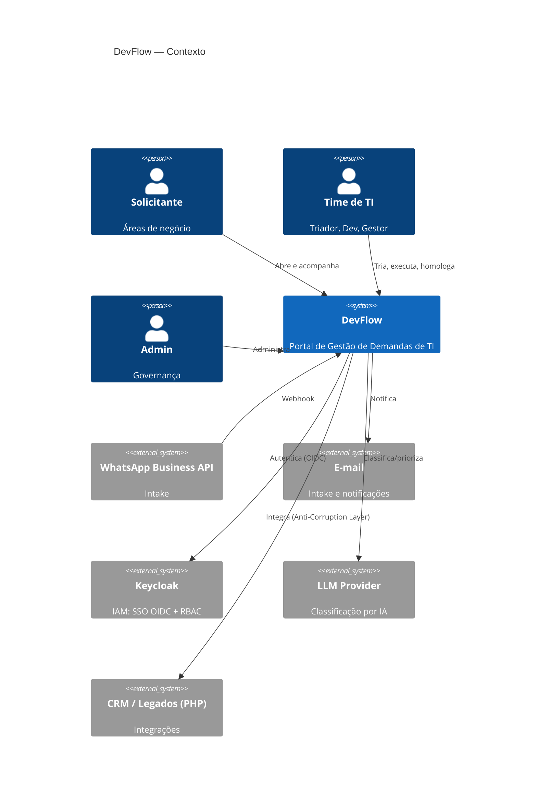
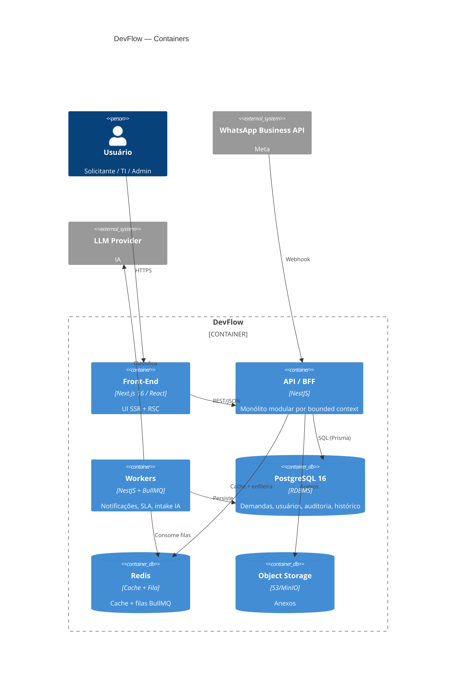
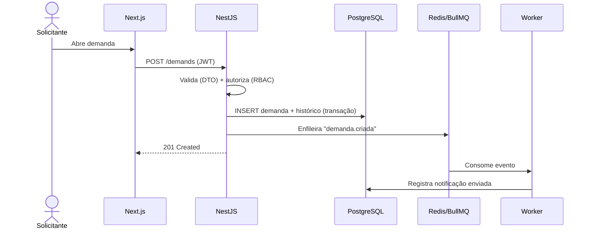
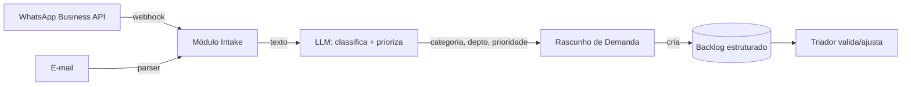

# Arquitetura

## Princípios

1. **Comece simples, escale por evidência** — monólito modular agora; microserviço quando o domínio exigir.
2. **DDD tático** — módulos por bounded context, baixo acoplamento, alta coesão.
3. **12-Factor App** — config no ambiente, stateless, logs como stream, paridade dev/prod.
4. **Stateless + escala horizontal** — qualquer instância atende qualquer request.
5. **Event-driven onde agrega** — notificações, auditoria e intake via fila.

## C4 — Nível 1: Contexto



## C4 — Nível 2: Container



## C4 — Nível 3: Módulos da API (bounded contexts)

```
src/modules/
├── identity/        # Usuários, departamentos, perfis, auth
├── demands/         # CORE: Demanda (aggregate root), status, prioridade, workflow
├── comments/        # Comentários
├── attachments/     # Anexos (S3)
├── sla/             # Cálculo e monitoramento de SLA
├── notifications/   # E-mail, WhatsApp, in-app (via fila)
├── audit/           # Trilha de auditoria append-only
├── intake/          # Webhook WhatsApp/e-mail + classificação IA
└── reports/         # Dashboards e exportações
```

Cada módulo é um bounded context isolado, comunicando-se por interfaces/eventos. Um módulo que
precise escalar sozinho (ex.: `intake`, `notifications`) já está pronto para ser extraído como
microserviço — trocando a chamada in-process por mensageria.

## Stack e justificativas

| Camada | Escolha | Justificativa |
|---|---|---|
| Front-end | **Next.js 16 (React)** | SSR/RSC para performance e segurança (menos JS no cliente, dados no servidor); App Router; mobile-first |
| Back-end | **NestJS (Node/TS)** | Modular nativo (DI) → DDD tático; TypeScript ponta a ponta |
| API | **REST/JSON + OpenAPI** | Contrato e documentação automática |
| DB principal | **PostgreSQL 16** | ACID no workflow; JSONB para flexibilidade; full-text nativo; RLS |
| Cache + Fila | **Redis + BullMQ** | Cache de leitura; jobs assíncronos resilientes |
| Object Storage | **S3 / MinIO** | Anexos fora do RDBMS; URLs pré-assinadas |
| Identidade & Auth | **Keycloak** (IAM) + JWT/OIDC | SSO, MFA e **RBAC centralizados** num IdP open source; NestJS valida o token e aplica os papéis nos guards. Stateless → escala horizontal |
| IA | **LLM via API** | Classificação/priorização no intake |
| Infra | **Docker + AWS** (região São Paulo) | Serviços gerenciados (RDS, ElastiCache, S3); dado no Brasil (LGPD); portável via Docker/12-factor (sem lock-in forte) |
| CI/CD | **GitHub Actions** | Código no GitHub; alinhado à direção AI-native da Microsoft (Azure DevOps segue forte em enterprise) |
| IaC | **Terraform** | Infra versionada e reproduzível; multi-cloud (sem lock-in). **Pulumi** como alternativa viável (IaC em TypeScript) |
| ORM | **Prisma** | Type-safe, migrations versionadas |

## Fluxo de criação de demanda



## Intake inteligente



Demandas que hoje chegam de forma informal no WhatsApp passam a entrar estruturadas: a IA lê a
mensagem, classifica e cria a demanda já priorizada no backlog.

## Architecture Decision Records (ADRs)

### ADR-001 — Monólito modular em vez de microserviços
- **Contexto:** 100 usuários hoje, meta 50k; time enxuto.
- **Decisão:** Monólito modular (módulos por bounded context).
- **Alternativa rejeitada:** Microserviços desde o início — complexidade operacional, latência de rede e transações distribuídas sem necessidade.
- **Consequência:** Velocidade agora; caminho de extração claro depois.

### ADR-002 — PostgreSQL como banco principal
- **Decisão:** Postgres 16 relacional.
- **Porquê:** Workflow exige ACID; histórico/auditoria exigem integridade; JSONB cobre flexibilidade sem NoSQL dedicado.

### ADR-003 — Comunicação assíncrona por fila
- **Decisão:** Notificações, SLA e IA em workers via BullMQ/Redis.
- **Porquê:** Não bloquear o request; resiliência (retry); desacoplamento.

### ADR-004 — Keycloak (IAM) + Auth stateless (JWT/OIDC)
- **Decisão:** Keycloak como Identity Provider (SSO OIDC, MFA, RBAC centralizado); JWT curto + refresh; NestJS valida o token e aplica papéis nos guards (CASL para autorização fina).
- **Alternativa rejeitada:** Implementar autenticação do zero — área crítica e propensa a falha, sem ganho.
- **Porquê:** Não reinventar auth; centralizar identidade e papéis; stateless escala horizontal.

### ADR-005 — CI/CD em GitHub Actions e IaC em Terraform
- **Contexto:** Código no GitHub; infra na AWS.
- **Decisão:** **GitHub Actions** para CI/CD; **Terraform** para IaC.
- **Alternativas:** AWS CodePipeline/CodeBuild (rejeitado: pior DX, mais acoplado — a própria AWS fechou o CodeCommit para novos clientes em 2024); CloudFormation/CDK (rejeitado: lock-in AWS); **Pulumi** (IaC em TypeScript) — mantido como alternativa, não padrão, para não fragmentar a stack de IaC.
- **Porquê:** Actions integra nativo ao repositório (gates no PR) e faz deploy na AWS via OIDC; Terraform é padrão de mercado e multi-cloud, coerente com evitar lock-in.
- **Nota:** se a empresa usa Azure DevOps/GitLab, a esteira se adapta — mudam as ferramentas, não os princípios (gates, IaC, rollback).
