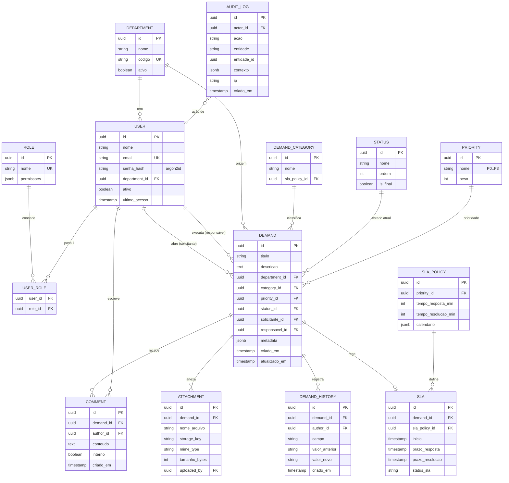

# Modelagem de Dados

Modelo relacional normalizado (3FN) com **histórico de negócio** e **trilha de auditoria** como
cidadãos de primeira classe — ambos append-only.

## Diagrama Entidade-Relacionamento



## Decisões de modelagem

| Decisão | Porquê |
|---|---|
| **UUID** como PK | Evita enumeração (segurança); facilita sharding na escala |
| **STATUS/PRIORITY/CATEGORY** como tabelas | Workflow configurável sem deploy; relatórios consistentes |
| **DEMAND_HISTORY** append-only | Histórico imutável de mudanças de negócio |
| **AUDIT_LOG** separado | Auditoria de segurança/compliance (LGPD) distinta do histórico de negócio |
| **metadata jsonb** | Campos específicos por tipo sem alterar schema |
| **SLA vs SLA_POLICY** | Política é o template; SLA é a instância calculada por demanda |
| **COMMENT.interno** | Separa comentário interno de TI do visível ao solicitante |
| **Anexos em S3** | Não inflar o RDBMS; performance e custo |
| **USER_ROLE N:N** | Usuário pode ter múltiplos papéis |

## Índices e performance

```sql
CREATE INDEX idx_demand_status_priority ON demand (status_id, priority_id);
CREATE INDEX idx_demand_department ON demand (department_id);
CREATE INDEX idx_demand_responsavel ON demand (responsavel_id) WHERE responsavel_id IS NOT NULL;
CREATE INDEX idx_demand_fts ON demand USING gin (to_tsvector('portuguese', titulo || ' ' || descricao));
CREATE INDEX idx_history_demand ON demand_history (demand_id, criado_em DESC);
CREATE INDEX idx_audit_actor_date ON audit_log (actor_id, criado_em DESC);
CREATE INDEX idx_sla_status ON sla (status_sla, prazo_resolucao) WHERE status_sla <> 'violado';
```

## Integridade e estratégias

- **Soft delete** em `USER`/`DEPARTMENT` (`ativo=false`) — preserva histórico e atende LGPD.
- **Transação** ao mudar status: `UPDATE demand` + `INSERT demand_history` no mesmo commit.
- **Outbox pattern** para eventos (notificação, IA): evento gravado na mesma transação → worker publica.
- **Row-Level Security (RLS)** opcional para isolar dados por departamento.
