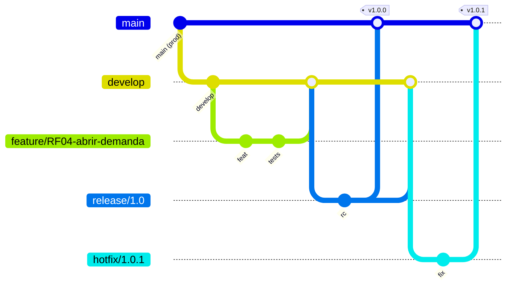
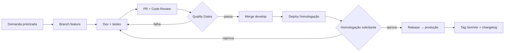

# Governança de Desenvolvimento e Qualidade de Código

## Estratégia de branching — GitFlow



- **`main`** — produção, sempre deployável, protegida.
- **`develop`** — integração, base das features.
- **`feature/*`** — uma feature por branch, curta vida.
- **`release/*`** — estabilização + homologação.
- **`hotfix/*`** — correção emergencial em produção.

Em cenário de deploy contínuo com time maduro, evolução natural para **trunk-based + feature flags**.

## Conventional Commits + SemVer

```
feat(demands): priorização por matriz impacto x urgência (RF07)
fix(sla): contagem de prazo iniciando na triagem (RN02)
chore(ci): scan de dependências
```

`feat`=minor, `fix`=patch, `BREAKING CHANGE`=major. Validação com `commitlint` + `husky`.
Changelog gerado automaticamente.

## Pull Request e Code Review

- PR pequeno (< ~400 linhas).
- Mínimo 1 aprovação (2 em código crítico: auth, billing, migrations).
- **Branch protection:** sem merge sem CI verde + review + sem conflitos.
- **PR template** com checklist (testes, doc, migration, breaking change, impacto LGPD).
- **CODEOWNERS** para módulos sensíveis.

Foco do reviewer: corretude e regra de negócio, SOLID/Clean Code, testes (com edge cases),
segurança (input/authz), performance (N+1, índices).

## Quality Gates (bloqueiam o merge)

| Gate | Ferramenta | Critério |
|---|---|---|
| Lint | ESLint + Prettier | 0 erros |
| Type check | `tsc --noEmit` | 0 erros |
| Testes | Jest | 100% passando |
| Cobertura | Jest --coverage | ≥ 80% no core |
| Qualidade | SonarQube | Quality Gate "Passed" |
| Dependências | Snyk / `npm audit` | 0 high/critical |
| Secrets | Gitleaks | 0 secret vazado |
| Commits | commitlint | Conventional Commits |

## Exemplo de código (camadas, DTO, SOLID)

```typescript
// dto/create-demand.dto.ts — validação na borda
export class CreateDemandDto {
  @IsString() @Length(5, 120) titulo: string;
  @IsString() @MinLength(10) descricao: string;
  @IsUUID() departmentId: string;
  @IsUUID() categoryId: string;
}

// demands.controller.ts — controller fino, sem regra de negócio
@Controller('demands')
@UseGuards(JwtAuthGuard, RolesGuard)
export class DemandsController {
  constructor(private readonly demands: DemandsService) {}

  @Post()
  @Roles('Solicitante', 'Triador', 'Admin')
  create(@Body() dto: CreateDemandDto, @CurrentUser() user: User) {
    return this.demands.create(dto, user);
  }
}

// demands.service.ts — regra de negócio isolada e testável
@Injectable()
export class DemandsService {
  constructor(
    private readonly repo: DemandsRepository,   // Dependency Inversion
    private readonly events: EventBus,
  ) {}

  async create(dto: CreateDemandDto, user: User): Promise<Demand> {
    const demand = Demand.open({ ...dto, solicitanteId: user.id }); // domínio rico
    await this.repo.save(demand);
    await this.events.publish(new DemandCreatedEvent(demand.id));
    return demand;
  }
}
```

```typescript
// demands.service.spec.ts — teste unitário (arrange/act/assert)
describe('DemandsService', () => {
  it('cria demanda no status Aberta e publica evento', async () => {
    const { service, repo, events } = setup();
    const demand = await service.create(makeDto(), makeUser());
    expect(demand.status).toBe('Aberta');
    expect(repo.save).toHaveBeenCalledOnce();
    expect(events.publish).toHaveBeenCalledWith(expect.any(DemandCreatedEvent));
  });
});
```

Princípios evidenciados: controller fino (SRP), validação na borda, injeção por interface
(Dependency Inversion), domínio rico (regra na entidade), efeito colateral via evento, teste AAA.

## Definition of Done

- [ ] Todos os quality gates aprovados.
- [ ] Code review aprovado.
- [ ] Testado em homologação (espelho de produção).
- [ ] Homologado pelo solicitante (aceite de negócio — RN04).
- [ ] Documentação/changelog atualizados.
- [ ] Suíte e2e verde (sem regressão).

## Processo de mudança



Mudança emergencial via `hotfix/*` com post-mortem e auditoria. Toda release é reversível
(imagem anterior + migration reversível).
