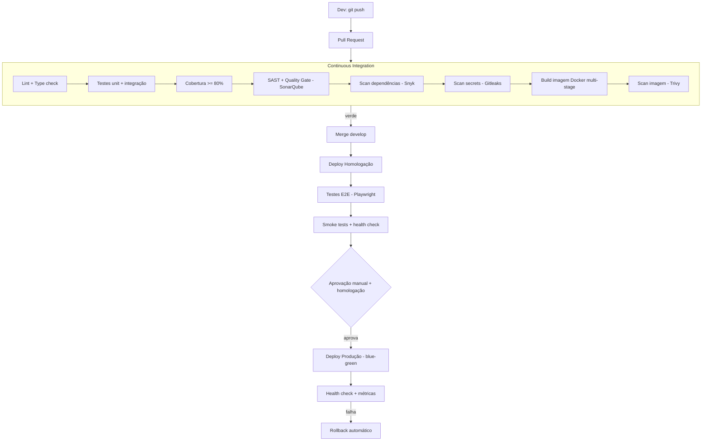

# DevOps e Esteira CI/CD

## Visão geral

## Estágios (commit → produção)

| Estágio | Ferramentas | O que faz | Bloqueia |
|---|---|---|---|
| Commit | Husky + commitlint + lint-staged | Valida commit e lint local | ✅ |
| Lint/Type | ESLint, Prettier, `tsc` | Estilo e tipos | ✅ |
| Testes | Jest (unit + integração) | Lógica e contratos | ✅ |
| Cobertura | Jest --coverage | ≥ 80% no core | ✅ |
| SAST | SonarQube | Bugs, smells, vulns no código | ✅ |
| SCA | Snyk / `npm audit` | Vulns em dependências | ✅ |
| Secrets | Gitleaks | Token/senha vazado | ✅ |
| Build | Docker multi-stage | Imagem enxuta e reproduzível | ✅ |
| Scan imagem | Trivy | CVE na imagem base | ✅ |
| Deploy homolog | ArgoCD / Actions | Ambiente espelho de produção | auto |
| E2E | Playwright | Fluxos críticos | ✅ |
| Aprovação | manual + aceite | Gate humano (RN04) | ✅ |
| Deploy prod | blue-green / rolling | Sem downtime | — |
| Pós-deploy | health, Prometheus, Sentry | Observa e dispara rollback | auto |

## Estratégia de deploy

- **Blue-Green / Rolling** → zero downtime.
- **Migrations** versionadas e reversíveis (expand/contract para mudanças incompatíveis).
- **Feature flags** → desacoplam deploy de release.
- **Rollback automático** se o health check pós-deploy falhar.

## Ambientes

| Ambiente | Propósito | Deploy |
|---|---|---|
| dev | desenvolvimento local | Docker Compose |
| homologação | espelho de produção, E2E + aceite | automático no merge `develop` |
| produção | usuários reais | manual aprovado a partir de `main` |

## IaC e observabilidade

- **Docker** multi-stage; **Terraform/OpenTofu** para provisionar cloud; **secrets** em cofre (12-Factor).
- **Logs** (Pino → Loki), **métricas** (Prometheus + Grafana), **tracing** (OpenTelemetry),
  **erros** (Sentry), **alertas** (Grafana → Slack/WhatsApp).
