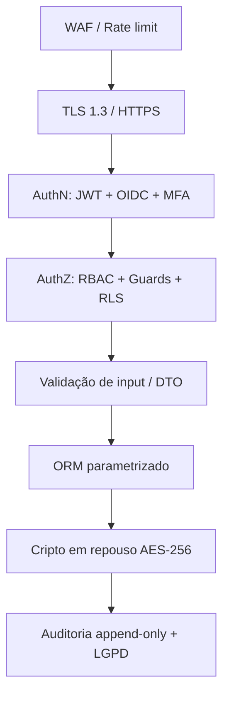

# Segurança

Defesa em camadas cobrindo autenticação, autorização, criptografia, auditoria e LGPD.

## Autenticação (AuthN)

- **JWT** curto (15 min) + **refresh token** rotativo (httpOnly, secure).
- **SSO corporativo via OIDC** (Google/Microsoft).
- Senha com hash **Argon2id**; política de complexidade.
- **MFA** para perfis privilegiados (Admin, Aprovador).
- **Rate limiting** + bloqueio progressivo (anti brute-force).

## Autorização (AuthZ)

- **RBAC** com guards no NestJS (`@Roles()`).
- **Menor privilégio** por papel.
- **Ownership check** — solicitante vê apenas o seu escopo/departamento.
- **Row-Level Security (RLS)** no Postgres como defesa em profundidade.

## Criptografia

| Onde | Como |
|---|---|
| Em trânsito | TLS 1.3 (HTTPS), HSTS |
| Em repouso | AES-256 (DB, backups, storage) |
| Senhas | Argon2id |
| Segredos | Cofre (Secrets Manager), nunca no código |
| PII crítica | Criptografia em coluna |

## Segurança da aplicação (OWASP Top 10)

- Validação de input em todo DTO → anti-injeção.
- ORM parametrizado (Prisma) → anti SQL Injection.
- Sanitização de output + CSP → anti XSS.
- CSRF tokens + SameSite cookies.
- Upload seguro (RN05): tipos permitidos, limite 25MB, antivírus, URLs pré-assinadas.
- Headers de segurança (Helmet); dependências escaneadas no CI.

## Auditoria

- `AUDIT_LOG` **append-only**: ator, ação, entidade, IP, timestamp.
- Imutável (sem UPDATE/DELETE); retenção parametrizada.
- Cobre login, mudança de status/prioridade, acesso a PII, alteração de permissão.

## LGPD

| Princípio | Medida concreta |
|---|---|
| Finalidade/Minimização | Coleta só o necessário |
| Consentimento | Termo no primeiro acesso; base legal definida |
| Direito de acesso | Endpoint de exportação dos próprios dados |
| Exclusão/anonimização | Anonimização preservando auditoria |
| Rastreabilidade de PII | `AUDIT_LOG` registra acesso a dado pessoal |
| Retenção | Política com expurgo automático |
| Segurança | Cripto em trânsito/repouso + acesso mínimo |

## Defesa em camadas

