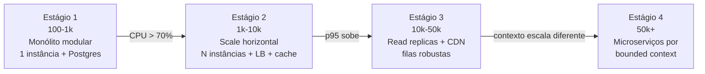
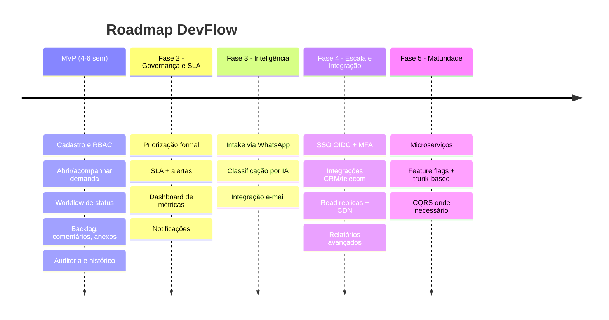

# Escalabilidade e Evolução

A arquitetura nasce **stateless e modular** para evoluir sem reescrita. A escala vem por **estágios
guiados por métricas**, não por antecipação especulativa.

## Estágios de escala

| Estágio | Usuários | Mudança | Gatilho |
|---|---|---|---|
| 1 | 100–1k | Monólito modular, 1 instância | start |
| 2 | 1k–10k | Scale horizontal (N instâncias + LB), cache Redis | CPU > 70% / p95 > 300ms |
| 3 | 10k–50k | Read replicas, CDN, workers dedicados, PgBouncer | leitura domina, contenção no DB |
| 4 | 50k+ | Extração de microserviços, event-driven, CQRS onde necessário | contexto vira gargalo isolado |

## Técnicas por dimensão

| Dimensão | Técnica |
|---|---|
| App | Stateless → scale horizontal; autoscaling |
| Leitura | Cache Redis (cache-aside), read replicas, CDN |
| Escrita | Fila assíncrona, outbox, batch |
| DB | Índices, particionamento de histórico/auditoria por data, PgBouncer, replicas |
| Anexos | S3 + CDN |
| Resiliência | Circuit breaker, retry com backoff, idempotência, graceful degradation |
| Custo | Autoscaling para baixo em ociosidade |

## Extração de microserviços

Um microserviço é extraído quando um bounded context tem **motivo independente para mudar ou escalar**
(ex.: `intake` com picos e cadência de release próprios). Como os módulos já são isolados, a extração
é mecânica, não uma reescrita — introduzindo então saga (transação distribuída), API gateway e
mensageria (RabbitMQ/Kafka).

## Roadmap evolutivo

| Fase | Foco | Valor entregue |
|---|---|---|
| MVP (4–6 sem) | Dor central | Demandas estruturadas, backlog, histórico, auditoria |
| Fase 2 | Governança e SLA | Priorização, SLA, dashboard |
| Fase 3 | Inteligência | Intake WhatsApp + IA |
| Fase 4 | Escala e integração | SSO, CRM/telecom, replicas, CDN |
| Fase 5 | Maturidade técnica | Microserviços, feature flags, CQRS |

O MVP entrega valor em 4–6 semanas resolvendo a dor central; cada fase agrega sem reescrever a
anterior, porque a arquitetura nasceu modular e stateless.
