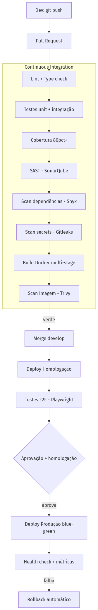
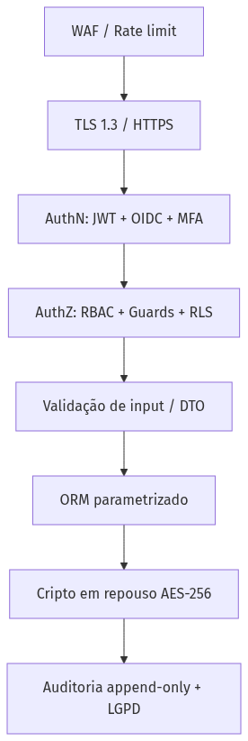

<!-- _class: lead -->
<!-- _paginate: false -->

# DevFlow

## Portal de Gestão de Demandas de TI

Concepção da solução — arquitetura, dados, governança, DevOps, segurança e evolução

---

# O problema

As demandas internas de TI chegam por **WhatsApp e e-mail**, sem controle:

- ❌ Sem backlog estruturado
- ❌ Sem priorização formal
- ❌ Sem SLA
- ❌ Sem histórico de mudanças
- ❌ Sem rastreabilidade das entregas

**Objetivo:** um portal onde as áreas (Comercial, Atendimento, Financeiro, Marketing, Jurídico,
Operações) abrem solicitações para TI e acompanham todo o ciclo — com governança e métricas.

---

# Abordagem e stack

> Começar simples, escalar por evidência. Cada decisão justificada.

| Camada | Escolha |
|---|---|
| Front-end | **Next.js 15** (React, SSR/RSC) |
| Back-end | **NestJS** (Node/TS) — monólito modular por bounded context |
| Dados | **PostgreSQL 16** + **Redis** (cache/fila) |
| Assíncrono | **BullMQ** (notificações, SLA, intake) |
| Inteligência | **WhatsApp Business API** + **LLM** (classifica/prioriza no intake) |
| Infra | **Docker**, cloud, CI/CD com quality gates |

---

# 1. Requisitos funcionais (MoSCoW)

- **Identidade:** usuários, departamentos, perfis (**RBAC**), SSO
- **Demanda:** abertura, **workflow configurável**, **backlog**, **priorização** (impacto × urgência)
- **Colaboração:** comentários, anexos, **histórico/timeline**
- **SLA:** política por prioridade, alerta de risco, violação
- **Intake inteligente:** WhatsApp + IA, e-mail
- **Gestão:** dashboard, relatórios, **trilha de auditoria**

---

# 1. Requisitos não funcionais

| Categoria | Alvo |
|---|---|
| Performance | p95 API < 300ms |
| Escalabilidade | 100 → 50.000 usuários sem reescrita |
| Disponibilidade | 99,9% uptime |
| Segurança | TLS 1.3 + AES-256 |
| LGPD | minimização, anonimização, log de PII |
| Auditabilidade | 100% das ações sensíveis, imutável |
| Manutenibilidade | cobertura ≥ 80%, lint obrigatório |

---

# 2. Arquitetura — princípios

1. **Monólito modular** agora; microserviço quando o domínio exigir
2. **DDD tático** — módulos por bounded context
3. **12-Factor** — stateless, config no ambiente
4. **Event-driven** onde agrega (notificações, auditoria, intake)

---

# 2. C4 — Contexto


---

# 2. C4 — Container


---

# 2. Módulos (bounded contexts)

```
src/modules/
├── identity/    demands/    comments/
├── attachments/ sla/        notifications/
└── audit/       intake/     reports/
```

Cada módulo é isolado e comunica-se por interfaces/eventos. Um módulo que precise escalar sozinho
(ex.: `intake`, `notifications`) **já está pronto para virar microserviço** — sem reescrita.

---

# 2. Intake inteligente


Demandas que hoje chegam informais no WhatsApp entram **estruturadas**: a IA classifica e prioriza.

---

# 2. Decisões registradas (ADRs)

- **ADR-001** — Monólito modular > microserviços (complexidade sem retorno a 100 usuários)
- **ADR-002** — PostgreSQL (ACID no workflow; JSONB para flexibilidade)
- **ADR-003** — Assíncrono por fila (não bloquear request; resiliência)
- **ADR-004** — Auth stateless JWT + SSO OIDC (escala horizontal)

---

# 3. Modelo de dados


---

# 3. Histórico e auditoria

Duas tabelas **append-only**, resolvendo a dor de rastreabilidade:

- **`DEMAND_HISTORY`** — mudanças de negócio (campo, antes → depois, autor, quando)
- **`AUDIT_LOG`** — ações de segurança/compliance (login, acesso a PII) para LGPD

**Decisões:** UUID (segurança/sharding), status/prioridade como tabelas (workflow configurável),
JSONB para flexibilidade, anexos em S3, outbox para consistência de eventos.

---

# 4. Governança — GitFlow


`main` (prod) · `develop` (integração) · `feature/*` · `release/*` · `hotfix/*`
Conventional Commits → SemVer + changelog automático.

---

# 4. Qualidade como gate

Gates **bloqueantes** no CI: lint, `tsc`, testes, **cobertura ≥ 80%**, SonarQube, Snyk, Gitleaks.

```typescript
@Post()
@Roles('Solicitante', 'Triador', 'Admin')
create(@Body() dto: CreateDemandDto, @CurrentUser() user: User) {
  return this.demands.create(dto, user); // controller fino (SRP)
}
```

Controller fino · DTO valida na borda · DI (testável) · domínio rico · efeito colateral via evento.

---

# 5. DevOps — esteira CI/CD



Commit → testes → **scans (SAST/SCA/secrets/imagem)** → build → homolog → E2E → blue-green → rollback.

---

# 6. Segurança e LGPD



JWT+OIDC+MFA · RBAC+RLS · TLS+AES-256 · auditoria append-only · **LGPD: anonimização, log de PII, retenção**.

---

# 7. Escalabilidade — por estágios


Escala guiada por métricas, não por antecipação. Microserviço só quando um contexto exigir.

---

# 7. Roadmap evolutivo


MVP em 4–6 semanas resolve a dor central; cada fase agrega **sem reescrever** a anterior.

---

<!-- _class: lead -->

# DevFlow

Solução **sob medida**: intake no WhatsApp com IA, arquitetura que escala de 100 a 50 mil
sem reescrita, e a rastreabilidade que hoje não existe.

**Cada decisão com um porquê.**
