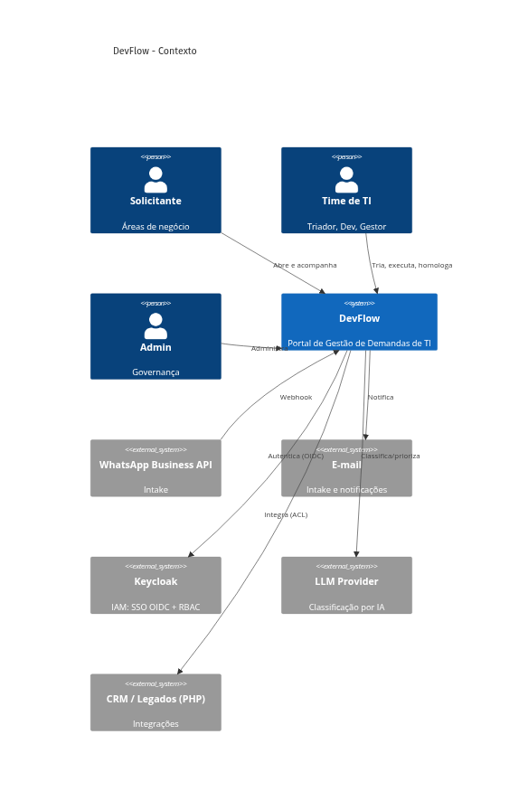
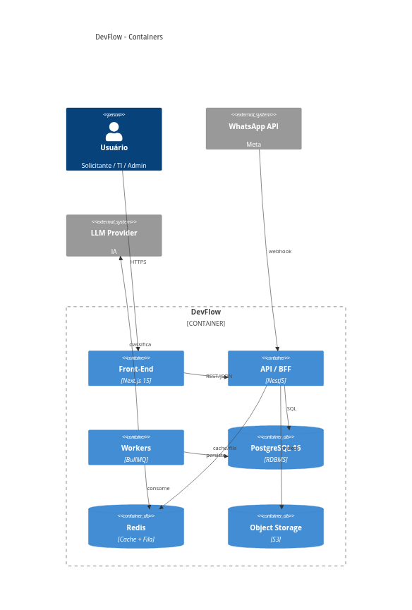
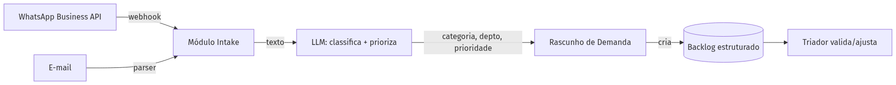
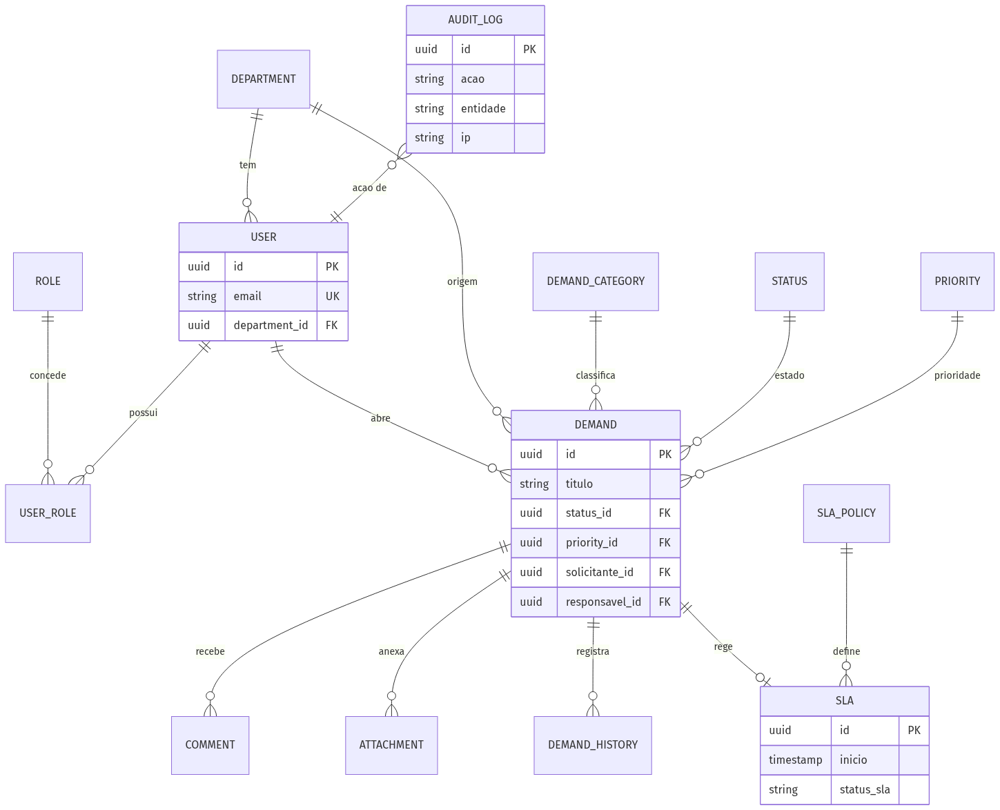
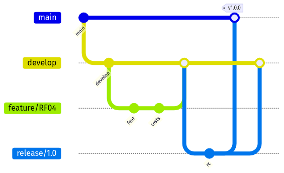
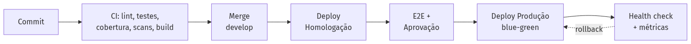
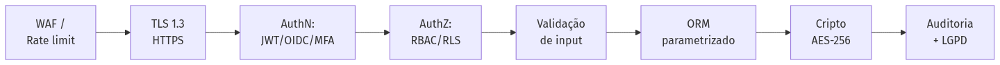
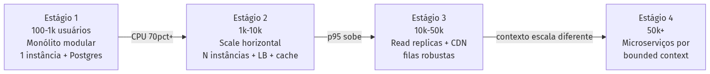
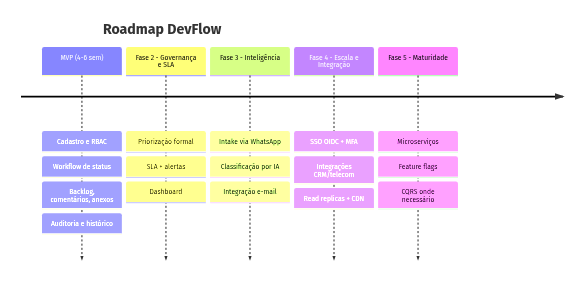

<!-- _class: lead -->
<!-- _paginate: false -->

# DevFlow

## Portal de Gestão de Demandas de TI

Concepção da solução — arquitetura, dados, governança, DevOps, segurança e evolução

---

# O problema

As demandas internas de TI chegam por **WhatsApp e e-mail**, sem controle:

- Sem backlog estruturado
- Sem priorização formal
- Sem SLA
- Sem histórico de mudanças
- Sem rastreabilidade das entregas

**Objetivo:** um portal onde as áreas (Comercial, Atendimento, Financeiro, Marketing, Jurídico,
Operações) abrem solicitações para TI e acompanham todo o ciclo — com governança e métricas.

---

# Abordagem e stack

> Começar simples, escalar por evidência. Cada decisão justificada.

| Camada | Escolha |
|---|---|
| Front-end | **Next.js 16** (React, SSR/RSC) |
| Back-end | **NestJS** — monólito modular por bounded context |
| Dados | **PostgreSQL 16** + **Redis** (cache/fila) |
| Identidade | **Keycloak** (IAM) — SSO OIDC + RBAC |
| Assíncrono | **BullMQ** (notificações, SLA, intake) |
| Inteligência | **WhatsApp Business API** + **LLM** (classifica/prioriza) |
| Infra | **Docker** + **AWS** (SP) · IaC **Terraform** · CI/CD **GitHub Actions** |

---

<!-- _header: 'Requisitos' -->

# 1. Requisitos funcionais — o que o sistema faz

| Área | Requisitos |
|---|---|
| Identidade | usuários, departamentos, perfis (RBAC), SSO via Keycloak |
| Demanda | abertura, workflow configurável, backlog, priorização (impacto × urgência) |
| Colaboração | comentários, anexos, histórico/timeline |
| SLA | política por prioridade, alerta de risco, violação |
| Intake | captura via WhatsApp + IA e e-mail |
| Gestão | dashboard, relatórios, trilha de auditoria |

---

<!-- _header: 'Requisitos' -->

# 1. Requisitos não funcionais — como se comporta

| Categoria | Alvo |
|---|---|
| Performance | p95 da API < 300ms |
| Escalabilidade | 100 → 50.000 usuários sem reescrita |
| Disponibilidade | 99,9% uptime |
| Segurança | TLS 1.3 + AES-256 |
| LGPD | minimização, anonimização, log de PII |
| Auditabilidade | 100% das ações sensíveis, imutável |
| Manutenibilidade | cobertura ≥ 80%, lint obrigatório |

---

<!-- _header: 'Arquitetura' -->

# 2. Arquitetura — princípios

1. **Monólito modular** agora; microserviço quando o domínio exigir
2. **DDD tático** — módulos por bounded context
3. **12-Factor** — stateless, config no ambiente
4. **Event-driven** onde agrega (notificações, auditoria, intake)

---

<!-- _class: diag -->

<!-- _header: 'Arquitetura' -->

# 2. C4 — Contexto



---

<!-- _class: diag -->

<!-- _header: 'Arquitetura' -->

# 2. C4 — Container



---

<!-- _header: 'Arquitetura' -->

# 2. Módulos (bounded contexts)

```
src/modules/
├── identity/    demands/    comments/
├── attachments/ sla/        notifications/
└── audit/       intake/     reports/
```

Cada módulo é isolado e comunica-se por interfaces/eventos. Um módulo que precise escalar sozinho
(ex.: `intake`, `notifications`) **já está pronto para virar microserviço** — sem reescrita.

---

<!-- _class: diag -->

<!-- _header: 'Arquitetura' -->

# 2. Intake inteligente



---

<!-- _header: 'Arquitetura' -->

# 2. Decisões registradas (ADRs)

- **ADR-001** — Monólito modular > microserviços (complexidade sem retorno a 100 usuários)
- **ADR-002** — PostgreSQL (ACID no workflow; JSONB para flexibilidade)
- **ADR-003** — Assíncrono por fila (não bloquear request; resiliência)
- **ADR-004** — Auth stateless JWT + SSO OIDC (escala horizontal)

---

<!-- _class: diag -->

<!-- _header: 'Modelagem de Dados' -->

# 3. Modelo de dados



---

<!-- _header: 'Modelagem de Dados' -->

# 3. Histórico e auditoria

Duas tabelas **append-only**, resolvendo a dor de rastreabilidade:

- **`DEMAND_HISTORY`** — mudanças de negócio (campo, antes → depois, autor, quando)
- **`AUDIT_LOG`** — ações de segurança/compliance (login, acesso a PII) para LGPD

**Decisões:** UUID (segurança/sharding), status/prioridade como tabelas (workflow configurável),
JSONB para flexibilidade, anexos em S3, outbox para consistência de eventos.

---

<!-- _class: diag -->

<!-- _header: 'Governança' -->

# 4. Governança — GitFlow



---

<!-- _header: 'Governança' -->

# 4. Qualidade como gate

Gates **bloqueantes** no CI: lint, `tsc`, testes, **cobertura ≥ 80%**, SonarQube, Snyk, Gitleaks.

```typescript
@Post()
@Roles('Solicitante', 'Triador', 'Admin')
create(@Body() dto: CreateDemandDto, @CurrentUser() user: User) {
  return this.demands.create(dto, user); // controller fino (SRP)
}
```

Controller fino · DTO valida na borda · DI (testável) · domínio rico · efeito colateral via evento.

---

<!-- _class: diag -->

<!-- _header: 'DevOps & CI/CD' -->

# 5. DevOps — esteira CI/CD



---

<!-- _class: diag -->

<!-- _header: 'Segurança' -->

# 6. Segurança em camadas



---

<!-- _header: 'Segurança' -->

# 6. Segurança e LGPD

- **AuthN:** **Keycloak** (IAM) — SSO OIDC + MFA + JWT; identidade e papéis centralizados
- **AuthZ:** RBAC com guards + Row-Level Security
- **Cripto:** TLS 1.3 (trânsito) + AES-256 (repouso) + Argon2id (senhas)
- **Auditoria:** trilha append-only e imutável
- **LGPD:** minimização, **anonimização** (preserva auditoria), log de acesso a PII, retenção

---

<!-- _class: diag -->

<!-- _header: 'Escalabilidade & Evolução' -->

# 7. Escalabilidade — por estágios



---

<!-- _class: diag -->

<!-- _header: 'Escalabilidade & Evolução' -->

# 7. Roadmap evolutivo



---

<!-- _class: lead -->

# DevFlow

Solução **sob medida**: intake no WhatsApp com IA, arquitetura que escala de 100 a 50 mil
sem reescrita, e a rastreabilidade que hoje não existe.

**Cada decisão com um porquê.**
